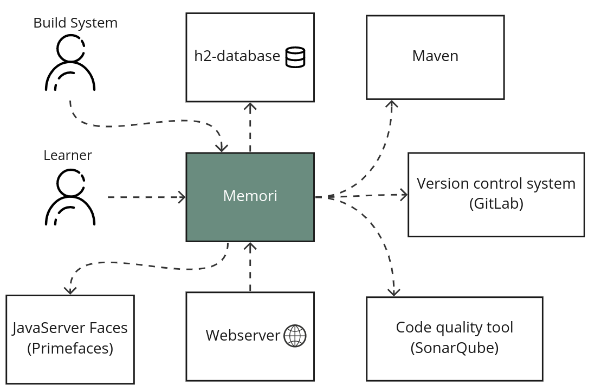
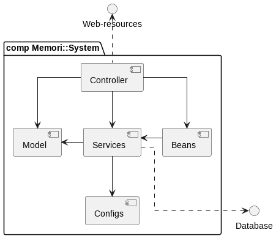
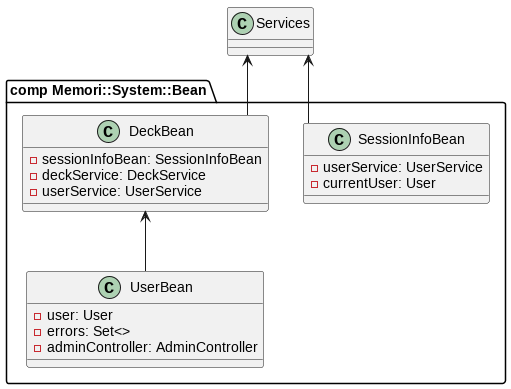
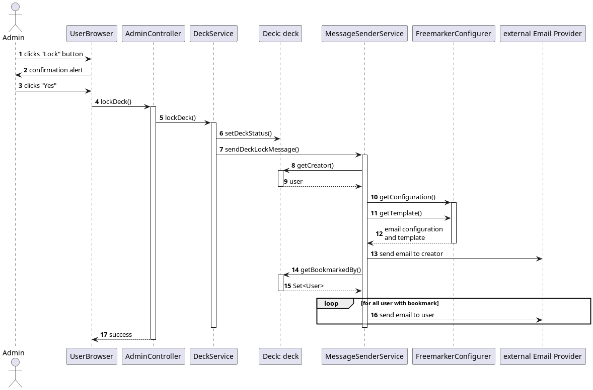
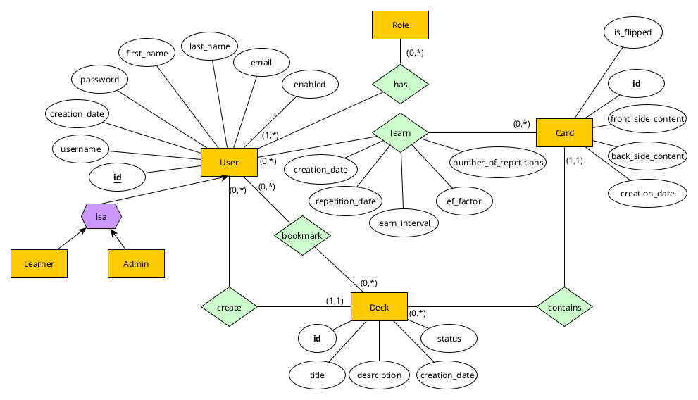
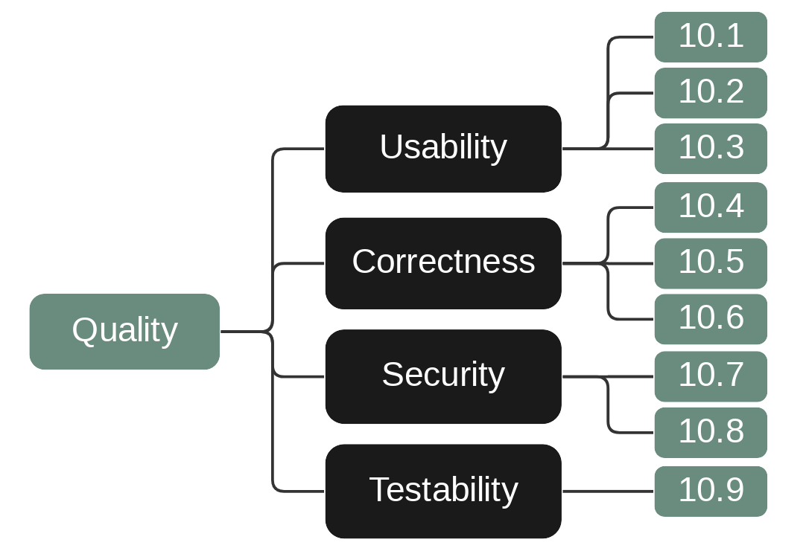

# **Memori** - Plant your Memory
## Software Architecture Project from Group G1T2

## 1. Introduction and Goals

*Memori* is a programming project of the software architecture course to develop a web platform that enables learning by Spaced Repetition and Active Recall. For this purpose, it should be possible for user to create decks of flashcards.

*Memori* is a project for
- efficient learning with the help of learning algorithms
- simple representation of content with flashcards
- creating and editing decks and cards
- using flashcards of other users
  
This project was realized in a group of five, by Johanna Backer, Marco Fröhlich, Lukas Kirchmair, Emanuel Prader and Nikolaus Schennach.

### 1.1 Requirement Overview
#### What is *Memori*?
The main idea behind *Memori* is to create a helpful web platform where students can summarize their content from lectures with the help of flashcards.

1. Users create a deck in which they can add an amount of cards.
2. The cards consist of a question and an answer.
3. In a learning view, decks can be learned and the cards can be repeated at a calculated time interval using the algorithm.

The learning cycle is determined by students' own assessment. Thus, there are 6 different levels of how well or poorly a question was answered. Based on this and other criteria, it can then be calculated when the card is to be learned again.

### 1.2 Use Cases  
| Identifier | Requirements        | Description                                                                                                                             |
|------------|---------------------|-----------------------------------------------------------------------------------------------------------------------------------------|
| M-1        | Create decks/cards  | An input window allows users to enter a name and description for the new deck and then create new cards.                                |
| M-2        | Edit decks/cards    | Name and description, as well as front and back of a card can be changed in the detailed view of the deck.                              |
| M-3        | Publish deck        | This deck is available to all registered students. They can add the deck to their saved-list.                                           |
| M-4        | Delete decks/cards  | When deleting a deck, all cards will also be deleted and other students who have bookmarked this deck will no longer have access to it. |
| M-5        | Show cards in deck  | The detail view gives users access to the list of all cards in the deck.                                                                |
| M-6        | Learn deck          | Users are directed to the learning view.                                                                                                |
| M-7        | Search for decks    | All published decks of other students can be displayed and bookmarked.                                                                  |
| M-8        | Repetitive learning | With the help of Spaced Repetitions and Active Recall, learners receive their learnable cards again and again at calculated intervals.  |

### 1.3 Quality Goals
| Identifier | Requirements | Explanation                                                                                                                                                                                          |
|------------|--------------|------------------------------------------------------------------------------------------------------------------------------------------------------------------------------------------------------|
| Q-1        | Usability    | Users can intuitively use the web platform and understand the individual features.                                                                                                                   |
| Q-2        | Correctness  | The algorithm calculates the correct date of the learned card and stores it persistently. Cards for today or before are correctly recognized and displayed by the program.                           |
| Q-3        | Security     | Other users are only able to delete or edit their own decks/cards. If there is not allowed content in the decks, the admin can lock them. Users are not able to add code-injections via text fields. |
| Q-4        | Testability  | The architecture should allow easy testing of all main building blocks.                                                                                                                              |

### 1.4 Stakeholders
| Role/Name | Goal                                                                                        | Expectations                                                                                                                                           |
|-----------|---------------------------------------------------------------------------------------------|--------------------------------------------------------------------------------------------------------------------------------------------------------|
| Learner   | Would like to use *Memori* to fill in content into decks and summarize on flashcards.       | Has no interest in the architecture of the system, only in the features (creating/editing decks/cards).                                                |
| Admin     | Controls the content of user-created decks and oversees the web platform to prevent errors. | Can use the features of *Memori* itself, but it's not a necessary functionality and therefore not of concern. He just wants a running, smooth program. |

 

## 2. Constraints and Conventions
### 2.1 Technical Constraints
| Identifier | Constraint                          | Background/Motivation                                                                                                                   |
|------------|-------------------------------------|-----------------------------------------------------------------------------------------------------------------------------------------|
| TC-1       | Implementation in Java              | *Memori* must be developed in Java.                                                                                                     |
| TC-2       | Use of Primefaces and Spring Boot   | *Memori* must be able to integrate Primefaces and Spring Boot Framework.                                                                |
| TC-3       | OS independent development          | *Memori* should run on all three mayor operation systems (Mac OS, Linux and Windows)                                                    |
| TC-4       | H2-Database                         | The internal database structure is based on a h2-database                                                                               |
| TC-5       | Spaced repetition and Active Recall | Implement Spaced Repetitions and Active Recall algorithms so that cards can be presented with ideal intervals for repetition.           |
| TC-6       | Skeleton Project                    | As a basis for our project, software architecture provided us with a so-called skeleton project, which already contained some features. |

### 2.2. Organizational Constraints
| Identifier | Constraint    | Background/Motivation                                                                                                                                                                                                   |
|------------|---------------|-------------------------------------------------------------------------------------------------------------------------------------------------------------------------------------------------------------------------|
| OC-1       | Team          | Johanna Backer, Marco Fröhlich, Lukas Kirchmair, Emanuel Prader and Nikolaus Schennach.                                                                                                                                 |
| OC-2       | Time schedule | Start in early december with skeleton project from proseminar. A first version should be ready by the end of january 2023. There are weekly meetings where the progress and problems of each team member are discussed. |
| OC-3       | Git           | *Memori* is created in a private git repository with a complete commit history.                                                                                                                                         |
| OC-4       | Testing       | Using JUnit/Mockito to prove functional correctness and SonarQube to ensure a high test coverage                                                                                                                        |
| OC-5       | Issue-Tracker | Bugs and new requirements, are maintained with help of the issue tracker from Gitlab.                                                                                                                                   |

### 2.3 Conventions
| Identifier | Convention                 | Background/Motivation                                          |
|------------|----------------------------|----------------------------------------------------------------|
| C-1        | Architecture documentation | Structure based on english arc42-template.                     |
| C-2        | Language                   | The internal language throughout the whole project is english. |
| C-3        | Naming conventions         | There are some naming conventions listed below.                |

The following naming conventions are used throughout the project:

All Java files follow a fixed folder structure.
<pre><code>src/main/java...:           java code
src/main/resources...:      no-sourcecode artifact
src/main/webapp...:         xhtml, frontend code
src/test/java...:           test sourcecode
</code></pre>
All Java types that represent a repository must have a name that ends with the suffix **Repository**.   All Java types that represent a service must have a name that ends with the suffix **Service**.   All Java types that represent a bean or controller must have a name that ends with the suffix **Bean** or **Controller**.
<pre><code>src/main/java/.../repositories/DeckRepository
src/main/java/.../services/DeckService
src/main/java/.../ui/bean/DeckBean
src/main/java/.../ui/bean/DeckDetailController
</code></pre>

 

## 3. System Scope and Context
This chapter describes the environment and context of *Memori*: Who uses the system and on which other system does *Memori* depend.

### 3.1 Business Context

| Neighbor               | Description                                                                                                                                                                                               |
|------------------------|-----------------------------------------------------------------------------------------------------------------------------------------------------------------------------------------------------------|
| Learner                | Creates decks and cards with internal features of *Memori*. Can use the learn view of the program to study cards.                                                                                         |
| JavaServer Faces       | Is responsible for building the web application. PrimeFaces was used, which is a JavaServer Faces based application.                                                                                      |
| Webserver              | *Memori* is displayed on a webserver and reachable via http. It is as well responsible to send emails if a deck has been locked by an admin                                                               |
| Code Quality Tool      | The project is controlled with an external quality tool (SonarQube) to avoid bugs or code smells and to ensure good test coverage. See [organizational constraints OC-4](#22-organizational-constraints). |
| Version control system | To ensure good collaboration and management of changes to the program, documents or other information, as mention in [organizational constraints OC-3](#22-organizational-constraints), Git was used.     |
| Maven                  | Given by our proseminar leader, Maven was used as the build management tool and for the project management.                                                                                               |
| H2-database            | Also given was the h2 database, which was then manually filled with default data.                                                                                                                         |

### 3.2 Technical Context

 | Neighbor               | Description                                                                                                                                              |
|------------------------|----------------------------------------------------------------------------------------------------------------------------------------------------------|
| *Memori* deployment    | The *Memori* deployment uploads its program with all its xhtml, css and java files to the webserver where the user can then access the complete program. |
 | Webserver              | The web server has the data uploaded by the *Memori* deployment and offers it to users who call it.                                                      |
| *Memori* user computer | The user uses a browser with different devices (laptop, cell phone) to access a web server and from there access the *Memori* program.                   |

 

## 4. Solution Strategy
*Memori* has been implemented in Java and has few external dependencies as it relies on internal input from users and is simply stored in a h2 database.

To stay true to the three-tier architecture, the project is built on a model-view-controller pattern (MVC):

All data holding entities are stored in a model folder and implemented there with the necessary getters and setters. The different services can access these, together with needed repositories, and implement more specific methods. The methods of the services can be accessed by the controllers to become even more specific and form a good interface for the UI.

Regarding the goal [usability (Q-1)](#13-quality-goals), the skeleton project of the software architecture lecture was used as a basis. This was supplemented with own xhtml pages and with the use of css a nice design was implemented. In advance, we looked at other similar projects to see what decisions were made there and what we could prefer or improve. Therefore, a design already existed at the beginning, which was only minimally modified.

[Correctness (Q-2)](#13-quality-goals) is achieved through multiple, extensive testing of the individual methods, as well as through manual use of the web application. This also helps to fulfill our goal of [testability (Q-4)](#13-quality-goals) to a certain extent. If an error or problem occurs, it is immediately recorded and processed by the Issue-Tracker.

To ensure that all team members were contributing to the project, weekly meetings were scheduled to discuss the current state of the project. One person dealt mainly with the UI, while the others worked on the backend first. If there were major problems, a solution was discussed and found as a team.
 

## 5. Building Block View

*Memori* can be divided into 3 blocks. The following diagram shows their interaction with each other. The dashed arrows represent dependencies between the subsystems.

### 5.1 *Memori* - Level 1
The following diagram, has already been zoomed into the *Memori* from the previously defined  [business context](#31-business-context). It should be noted that only the database and the user are specified as interfaces, as the others have been declared irrelevant for this representation.

| Building Block | Description                                                                             |
|----------------|-----------------------------------------------------------------------------------------|
| Web-resources  | Include xhtml files, as well as css for the visual appearance of the website.           |
| System         | The internal system of *Memori*, with all its methods and classes used for the program. |
| Database       | The external h2 database where some default values are stored.                          |

### 5.2 *Memori*::System - Level 2
In this diagram, the *Memori* system was examined more closely. There are five relevant entities whose dependencies are represented by solid lines. The exact tasks of each class are described in the table below.

| Building Block | Description                                                                                                                                 |
|----------------|---------------------------------------------------------------------------------------------------------------------------------------------|
| Controller     | The controller interacts with the web resources and waits for input from the user or other buttons. It then forwards these to the services. |
| Model          | Java represents real objects in these models that have been given certain properties.                                                       |
| Beans          | They contain simple methods that can be accessed from anywhere in the program.                                                              |
| Services       | Contain all functionalities of *Memori*, they interact with the database via repositories.                                                  |
| Configs        | This contains mainly configuration files.                                                                                                   |

### 5.3 *Memori*::System::... - Level 3
Below are some even more detailed illustrations of the individual services, controllers and beans. For a more detailed view of the models refer to [8.1 domain models](#81-domain-models).

#### 5.3.1 *Memori*::System::Services

| Building Block     | Description                                                                                    |
|--------------------|------------------------------------------------------------------------------------------------|
| UserService        | Provides all functionalities for a user object.                                                |
| DeckService        | Provides all functionalities for a deck object.                                                |
| LearnService       | Contains specified learn algorithm, provides all necessary functionalities for that.           |
| EmailSenderService | Provides functionalities to send email when a deck object gets locked or unlocked by an admin. |

#### 5.3.2 *Memori*::System::Controller

| Building Block         | Description                                                |
|------------------------|------------------------------------------------------------|
| UserListController     | Provides a list of all users for an admin.                 |
| UserBookMarkController | Provides all bookmarks of a user.                          |
| LearnController        | Provides learning environment for a specific deck and user |
| DeckListController     | Offers a search option for decks                           |
| DeckDetailController   | Provides a detailed view of a deck                         |
| UserDetailController   | Provides a detailed view of a user for an admin            |
| AdminController        | Provides all features for an admin                         |

#### 5.3.3 *Memori*::System::Bean

| Building Block  | Description                                                                                                                 |
|-----------------|-----------------------------------------------------------------------------------------------------------------------------|
| DeckBean        | This bean provides the display of decks for the home view, as well as filter functions for the primeface database.          |
| SessionInfoBean | With the help of this bean, you can request information about the current session, for example, who is currently logged in. |
| UserBean        | Provides options to create a new user.                                                                                      |

 

## 6. Runtime view

Since we also have [usability Q-1](#13-quality-goals) as a quality goal, the application is designed to be simple to interact with our system. Therefore, some use cases have been selected where an actual runtime view is shown below.
The following three scenarios were chosen for this purpose:
- creating a new deck
- learning a deck
- locking of a deck by an admin

### 6.1 Create a deck
When creating a deck, the user can initialize this via the home view. There, after the internal creation, a new empty deck is displayed where a title and a description for the deck must be entered.
In this view, the user can as well create cards. If he is finished, the user can save the deck, which gets displayed in his home.

### 6.2 Learn a deck
Learning a deck can also start via a button in the home view. First, the required cards are loaded internally into a container, and then each card is displayed individually to the user. The user can see the question and think about it, then turn over the card for the answer. After that he has to click on a difficulty before he gets the next card. Based on the selected difficulty, the program's algorithm can calculate how much time it will take to learn the card next. After that, the process repeats with the new card until all cards are learned or the user exits the LearnView.

### 6.3 Admin locking a deck
The locking of a deck is only possible as admin. The admin can check the content of public decks and decide whether the content does not comply with the usage guidelines and thus lock it.

 

## 7. Deployment view

| Node                   | Description                                                                                                              |
|------------------------|--------------------------------------------------------------------------------------------------------------------------|
| *Memori* user computer | Users can interact with the server via http and therefore use the *Memori* application.                                  |
| Webserver              | The webserver contains the binary files of *Memori* and also handles the h2-database.                                    |
| *Memori* development   | Computer for development of *Memori*. Only important for software developer who want to modify or extend the source code |
 
 

## 8. Concepts
### 8.1 Domain models

| Building Block | Description                                                                                                                                                                                                                                                                 |
|----------------|-----------------------------------------------------------------------------------------------------------------------------------------------------------------------------------------------------------------------------------------------------------------------------|
| User           | Stores all the data of a user. It is important that each user can have multiple roles assigned to them, these can be either a Learner or an Admin, both of which are users. Users can create decks or bookmark other decks. They can learn their own decks or public decks. |
| Card           | A card stores its data, including which deck it belongs to. It can be learned by the user.                                                                                                                                                                                  |
| Deck           | A deck stores its data and can be created by a user, or bookmarked by a user other than the creator. Each deck has a number of cards assigned to it.                                                                                                                        |

| Building Block | Description                                                                                                                                         |
|----------------|-----------------------------------------------------------------------------------------------------------------------------------------------------|
| UserCardInfo   | Parameters for the learn algorithm for specific card and user                                                                                       |
| UserCardInfoId | Defines id for UserCardInfo via id of user and card                                                                                                 |
| Card           | Contains all properties of a card, as well as the access possibilities to it.                                                                       |
| Deck           | Contains all properties of a deck, as well as the access possibilities to it.                                                                       |
| User           | Has all the information of a user and how to access these.                                                                                          |
| DeckStatus     | A deck can have different types of states, which are defined here.                                                                                  |
| UserRole       | A user can be either a learner or an administrator, but it should be noted that administrators can be both. Therefore, a set was used as container. |

### 8.2 Persistence

*Memori* uses a h2 database for storing relational data. It was decided to keep the default data for the first version (see [time schedule OC-2](#22-organizational-constraints)) in the file ./src/main/resources/data.sql and not to persist this h2 database.

All access to the database is done through the JPA using hibernate as provider. The JPA is never accessed directly but only through the Spring Data JPA, which are the repositories.

### 8.3 User Interface
The first version of our *Memori* UI was already included in the skeleton project, written in xhtml.

For visual representation we used css, which is based on our first design ideas.
Our design concept is to create a pleasant learning atmosphere, which is given a rather simple, dark design. The green nuances are meant to represent plant colors and are intended to have a calming effect, thus maintaining a longer motivation to learn.

### 8.4 Transaction Processing

To create all necessary beans for handling local transactions within the JPA, *Memori* relies on Spring Boot.
Furthermore, hibernate was used to more easily formulate SQL queries for the database.

### 8.5 Security
As far as security is concerned, the project has mainly relied on spring security, as it covers the essential aspects such as providing authentication and authorization.
A password encryptor was also added to make user data more secure.

### 8.6 Email Messanger
To send messages to the creator and all users who bookmarked a deck, on the event that it has been locked by one of our administrators,
a MessagingService has been implemented. As described by the specification of this project, emails are used to notify the users.
One implementation of the MessagingService is the EmailSenderService.

It uses the spring-boot-starter-mail dependency together with the
FreeMarker template engine to generate an email message containing a custom HTML body to be sent to all users affected by a deck being locked.
This MessagingService is being used by the DeckService to lock a deck and send the messages by using its DeckService::lockDeck method.

To successfully use the EmailSenderService some environment variables need to be set. More information can be found in the Emailing section of the README for this project.

 

## 9. Design Decisions
### 9.1 Handling deletions and locking
**Main decision:**
When something gets deleted from *Memori* this cannot be redone. To ensure the [usability goal Q-1](#13-quality-goals), a deletion must be confirmed by the user performing it.

***Deletion of decks:***
The only person, who is able to delete a deck, is the user that created it.
If a user deletes a deck, all cards associated to this deck, are deleted too. Furthermore, all bookmarks to this deck will be removed and other user can not access it anymore.

***Deletion of cards:***
Similar to the deletion of decks, the only person who is able to remove a card from a deck, is the user who created it.
If a card gets removed all UserCardInfo-entries associated to this particular card will also get erased.

***Deletion of users:***
Only administrators can remove users. When a user is removed all of his associated decks are removed as well as the UserCardInfo and the bookmarks.

***Locking of decks:***
An admin can lock decks that are marked public. If he does so, an email will be sent to the user who created it and all users that have this deck in their bookmarks.
Users with bookmarks will no longer see the locked deck in their saved decks view, therefore it cannot be accessed in any way.
The creator is also not able to see or access the locked deck, to access the deck it first has to be unlocked by an administrator.

### 9.2 Default database when stopping application:
***Problem:***
Data that is changed while the application is running will not be permanently saved.

***Constraints:*** In the given [skeleton project TC-6](#21-technical-constraints) the database was configured in this way.

***Assumption:*** Changing the database type entirely or making the h2-database persistence, would require too much time considering our [time schedule OC-2](#22-organizational-constraints).

***Decision:***
The database will not be changed for the first version of this application. Therefore, all changes will be set back once the application is stopped. If *Memori* should be deployed to the public in the future this has to be changed.

### 9.3 Algorithm parameters:

***Problem:***
Cards can be learned by different users, not only the creator. Therefore, the learn algorithm parameters are different for every user. We need a way to store this information in our database.

***Constraints:***
- A user can bookmark foreign decks and learn them.
- The parameters have to be stored correctly for every user individually.

***Considered Alternative:***
Storing the parameters directly in the card. This would result in storing a deep copy of every deck a user has bookmarked.

***Decision:***
Storing the values in an own datatable, the UserCardInfo, individually for every card and user. In order to display the amount of cards that have to be learned today and new cards in the home/learn view the application has to go through this table to gather the information. A card is considered to be new when there is no entry in the datatable for this card and user.

 

## 10. Quality Scenarios

| Quality | Description                                                                                                                                                                 |
|---------|-----------------------------------------------------------------------------------------------------------------------------------------------------------------------------|
| 10.1    | The user is able to edit all his decks and cards after creation. Typos or errors can be corrected.                                                                          |
| 10.2    | Even if a user leaves LearnView without having finished learning all the cards to be learned, the cards learned so far are correctly saved with the new date to be learned. |
| 10.3    | Should a deck or card wished to be deleted, the user must reconfirm this action via a pop-up. Since deleting is permanent and cannot be restored.                           |
| 10.4    | Each front and back of a card are correctly assigned and can not be mixed.                                                                                                  |
| 10.5    | Private decks can only be seen by the creator and not by other users.                                                                                                       |
| 10.6    | The cards that are still to be learned or new ones are always displayed and calculated correctly. These are also all displayed in the LearnView.                            |
| 10.7    | Only people registered by an admin can use the functionalities of *Memori*, as there is a login.                                                                            |
| 10.8    | The passwords of the users are only stored encrypted in the database and can therefore be hardly decrypted.                                                                 |
| 10.9    | The test coverage (measured by SonarQube) for the entire project should always be greater than 75%.                                                                         |

 

## 11. Technical Risks

There is a possibility that the h2 database may be corrupted by an unexpected shutdown of the VM (i.e. operating system or hardware failure). The risk can be mitigated by regular backups of the serialized database file.

 

## 12. Glossary

| Term          | Description                                                                                                                                                                                                                                                                               |
|---------------|-------------------------------------------------------------------------------------------------------------------------------------------------------------------------------------------------------------------------------------------------------------------------------------------|
| Card          | Cards consist of a front and back, a question and an answer. Cards can be flipped and are always associated with a deck.                                                                                                                                                                  |
| Deck          | Decks consist of a set of cards, which can be learned. Each deck has a title and a description, as well as a deck status, which indicates the visibility. So it is possible to share decks and learn from other users.                                                                    |
| User          | A user is using the application and can have different roles.                                                                                                                                                                                                                             |
| Admin         | An admin can be a user of the application, but also manages the content, as well as users.                                                                                                                                                                                                |
| LearnView     | The LearnView displays the cards that need to be learned. First the question is displayed, then the corresponding answer. Then a difficulty must be selected before switching to the next card.                                                                                           |
| LeanAlgorithm | The LearnAlgorithm is based on Spaced Repetitions and Active Recall and implements those principles.                                                                                                                                                                                      |
| UserCardInfo  | The UserCardInfo contains any data, for a specific user and card, that the LearnAlgorithm requires.                                                                                                                                                                                       |
| DeckStatus    | The DeckStatus is responsible for the visibility, so with Public a deck can be seen by other users, while with Private only the creator has access to it. Only the admin can lock a public deck, which will now not be shown to any users.  Unlocking can also only be done by the admin. |